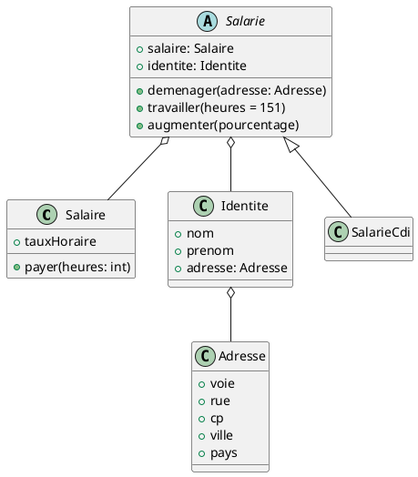

# Application gestion de personnel TP Java

---

Ce projet vous permet de créer des salariés, de les faire travailler, de les payer, de leur donner une adresse et de la
modifier comme bon vous semble.

---

## Voici le diagramme UML de notre application : 

## Dépendances à intaller pour les tests : 
    - junit jupiter api 
    - mockito junit jupiter
    - junit jupiter engine
    - junit jupiter params
    - mockito core

---

N'hésitez pas à soutenir ce projet via notre lien en le suivant sur notre page Linkedin :

