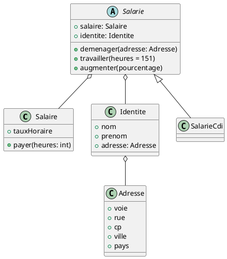

# Application gestion de personnel TP Java

Ce projet vous permet de créer des salariés, de les faire travailler, de les payer, de leur donner une adresse et de la
modifier comme bon vous semble.

## Pour commencer

Voici le diagramme de classes pour comprendre les liens entre ces dernières : 

### Pré-requis

Pour lancer les tests, il faut utiliser ces libraires :

    - junit jupiter api
    - mockito junit jupiter
    - junit jupiter engine
    - junit jupiter params
    - mockito core

## Démarrage

Pour démarrer le projet, vous pouvez vous placer sur le main et utiliser les classes et méthodes. Pour les test, 
rendez-vous dans le répertoire test et lancez les tests des classes que vous souhaitez tester

## Stacks :

Test effectués avec Junit et Mockito

## Contributing

Si vous souhaitez contribuer, vous pouvez faire une PR.

# Soutenez-nous !!! 

N'hésitez pas à soutenir ce projet via notre lien en le suivant sur notre page Linkedin :

